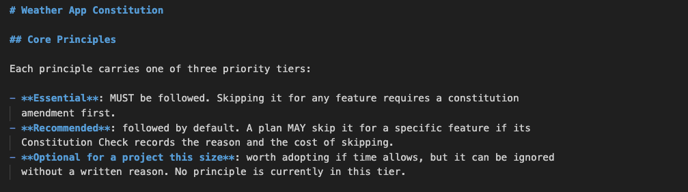
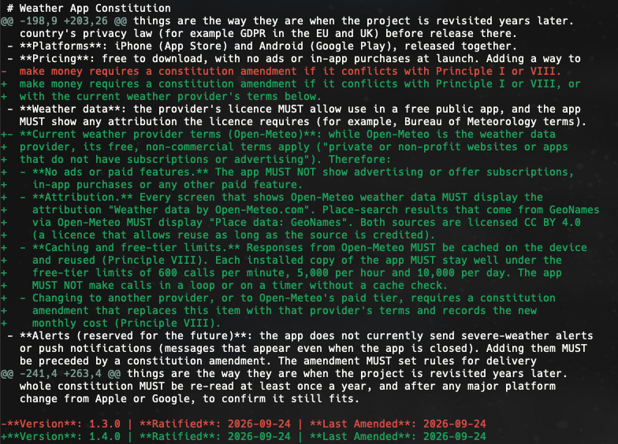
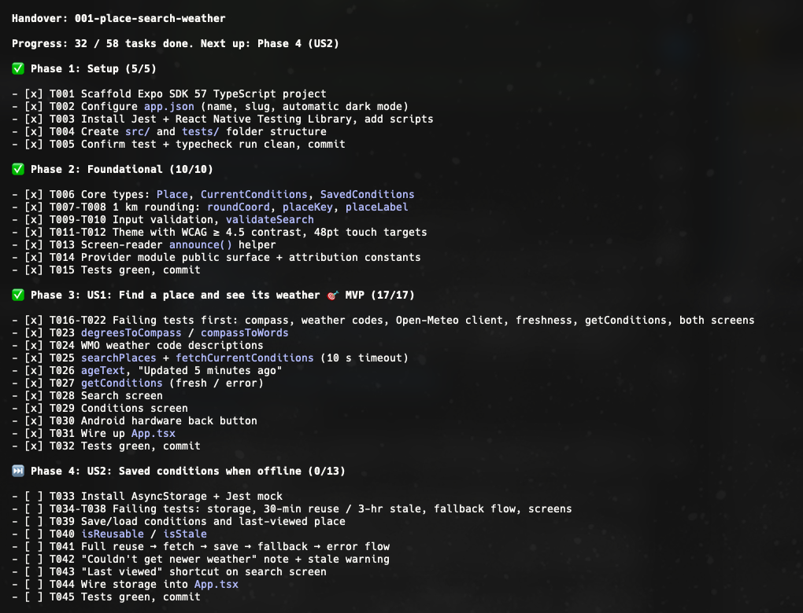
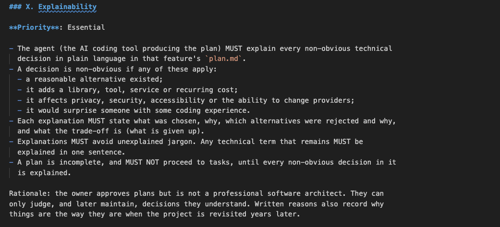
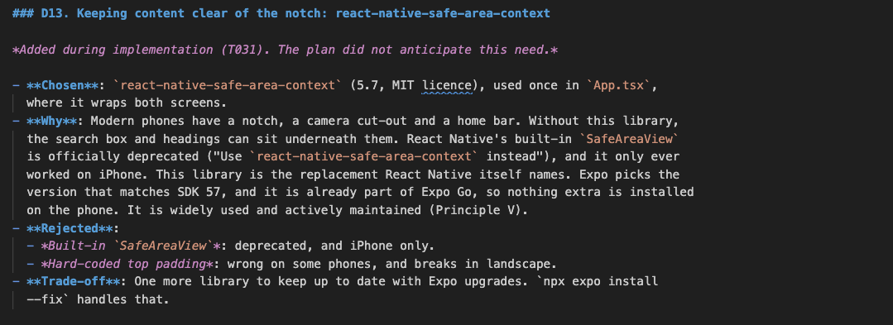
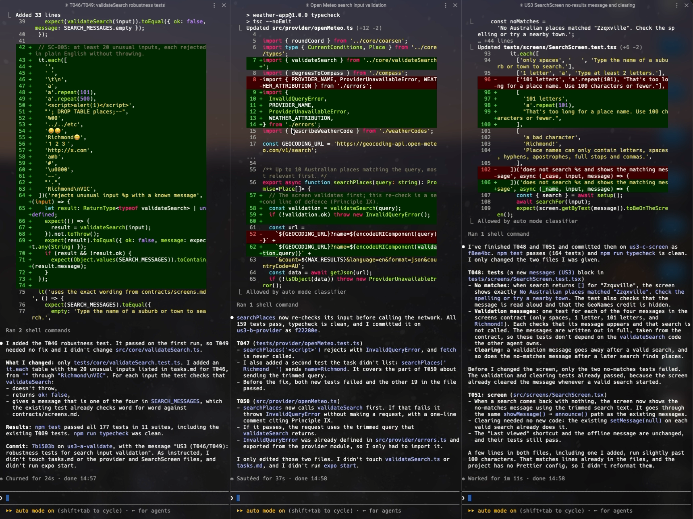
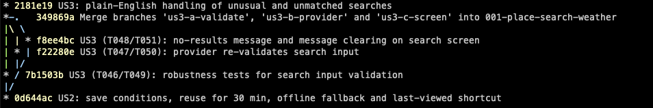

An AI coding agent has no memory worth relying on, so anything you want it to remember has to live somewhere it can read. That was the principle I took into a small experiment with Spec-Driven Development, and it's the one I came out with, though not for the reasons I expected.

The setup was deliberately unambitious. I installed GitHub's Spec-Kit, drove Claude Code from Warp, and built a weather app for Australian places: search for a suburb, see the current conditions, behave sensibly when the network doesn't. Nobody needs another weather app. I wanted to know what SDD feels like with tools I already use, and a small, boring product keeps the attention on the process.

## The workflow, as it happened

Spec-Kit starts with a constitution, a set of project-wide principles that every later step is checked against. Mine has ten, each with a priority tier: privacy by design, trustworthy when things go wrong, accessible to everyone, simple over clever, tested before shipped and so on. It was already at version 1.3 by my first commit. The 1.3 change added the principle I'd recommend to anyone trying this: the agent must explain every non-obvious technical decision in plain language in the plan.

From there the steps were specify, clarify, plan, tasks and implement. The first feature's spec ran to 24 functional requirements and seven measurable success criteria. The spec left one question open for me, whether the app should reopen on the last place viewed, and I chose to start on search with a "Last viewed" shortcut instead. Planning did real research, including live calls to the Open-Meteo API, and produced thirteen explained decisions covering things like why there's no navigation library and why the age of the data comes from the provider's timestamp rather than when the phone downloaded it.

Research also found something I hadn't considered. Open-Meteo is free for non-commercial use, which suits a free, ad-free app and stops suiting it the moment someone adds adverts. I read the terms, confirmed the interpretation and amended the constitution to 1.4, so attribution, caching and "no ads" became binding rules rather than things I'd have to remember. This is the part of SDD I liked most. A fact discovered once becomes a constraint every later session is checked against.

Tasks turned the feature into 58 items across six phases, with the failing test written before each piece of code and a commit at the end of every phase. The first user story was committed by lunchtime. The afternoon covered offline fallback, unusual searches, an accessibility and security pass and a manual check on my iPhone, and the feature was merged the same day with 186 passing tests.

## What worked

The documents did the job of memory. When I opened a new session and typed "let's pick up where we left off", the agent didn't need a recap. It read the checkboxes in tasks.md, saw the first user story was finished and started on the next task. Everything it needed for the second story, down to the exact wording of the error messages, was already written down.

Tests-first held up as a contract. Each task named the test to write, with specific inputs and expected outputs, so "done" was decided by the test suite rather than by the agent's opinion of its own work.

The explainability principle paid for itself. The plan reads like a design document a new starter could follow, with the rejected alternatives and trade-offs for each decision. I could review the agent's reasoning before any of it had become code, which is a lot cheaper than reviewing it afterwards.

## What didn't

The documentation is heavy for something this size. The constitution and feature documents come to about 1,400 lines. The app is about 1,000 lines of code and 1,000 lines of tests. That's more writing about the thing than the thing. Most of it is decisions I'd otherwise carry in my head, so I don't think it was wasted, but the ratio would have to come down for SDD to pay its way on small changes.

The specs were also confidently wrong in places, and always about the outside world. The plan named a React Native version the Expo template doesn't ship. It didn't foresee that the app needed a library to keep content clear of the iPhone notch, so a new decision was added mid-build with a note admitting it. One task told the agent to expect version 3 of a storage library and not assume version 2; Expo installed 2.2.0. The manual test plan asked me to reopen the app in flight mode, which can't work in Expo Go because it loads the app over Wi-Fi from your computer. The spec was consistent with itself. It just hadn't met a real phone yet.

## Three agents at once

For the third user story I ran three agents in parallel, each in its own Warp pane and git worktree. The split was easy because tasks.md already recorded which tasks touched which files. Each agent got one test-and-code pair, a list of files it could edit and two rules: don't touch tasks.md, and don't start the Expo dev server. All three committed within a minute of each other and the merge had no conflicts.

It worked, and it wasn't worth it. The whole story was about six small edits, and setting up worktrees, installing dependencies three times and writing three prompts cost about what running them one after another would have. What I'd keep is the reason it was possible at all. The coordination was already in the documents before anyone thought about parallelism.

## Surprises

Two things happened that no document anticipated. When the agents finished, the main folder had an uncommitted change downgrading Expo from SDK 57 to SDK 46 and rewriting nearly twelve thousand lines of the lockfile. The agents couldn't have done it, since they were working in other folders. The likeliest culprit is `npm audit fix --force`, whose proposed fix is exactly that version, but I can't prove it. The agent stopped before merging and asked me what to do.

Then I merged the pull request before the final manual check was recorded as done, even though the PR description said it should pass first. The checks did pass, but getting the tick onto main took a second PR. A gate written in a markdown file is a request. Nothing enforced it but me.

## Where I was still needed

Reading back through the history, my contributions were choosing the clarification option, reading a licence and deciding what it meant, deciding a dirty working tree should be thrown away, deciding whether parallel agents were worth trying, holding a phone with VoiceOver on and the text at its largest size, and choosing when to merge. None of that is writing code. All of it is judgement about the world outside the repository, or about risk.

[SCREENSHOT: The iPhone in flight mode showing saved weather with "Couldn't get newer weather. Showing saved weather from …"]
Caption: Offline fallback on a real phone. The one check no agent could do for me.

## What changed

The interesting shift wasn't speed. It was where the conversation happened. Without SDD I talk to an agent about code. With it, I mostly talked to the agent about the documents, and the documents told the agent about the code. They were the interface between us, between sessions and between agents that never knew the others existed.

That moves the human's job towards two things: writing constraints clearly enough that an agent can hold itself to them, and noticing when reality has drifted from what's written down. The agent was good at spotting drift. It flagged the version mismatches, the unworkable test step and the stray downgrade. It couldn't decide what any of them meant.

This was one small app, built by one person in a day, and I wouldn't stretch it to teams or large systems without trying it there. But it's changed how I see the constitution and the spec. They aren't paperwork for the agent. They're the part of the system I'm responsible for, which is familiar territory for an engineering manager: most of the job is writing down what's been agreed and noticing when the world has moved on from it.
