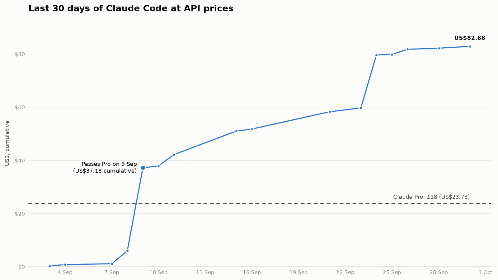

I pay £18 a month for Claude Pro and I was pretty confident I was wasting most of it because I rarely hit my usage limit, and let's be honest, a limit you never reach feels like money left on the table. So I planned an experiment: switch to the pay-as-you-go API for a month and compare the bill with the subscription. If you'd asked me to guess, I'd have said my usage was worth about £10 a month. It was actually worth £63. Doh! I was out by a factor of six.

## The logs already knew
I didn't need the month to find that out because Claude Code keeps a log of every session on your machine, token counts included, and an open source tool called [ccusage](https://github.com/ryoppippi/ccusage) reads those logs and prices them at API rates. So, one command against data I already had answered the question I was about to spend hours designing an experiment around. I used Claude Code on 16 of the last 30 days, mostly Sonnet 5 and then Opus 5.5, and at Anthropic's published API rates that came to US$82.88. At 2 October's rate of £1 = US$1.3186 that's £62.85, three and a half times the subscription. Pro had paid for itself by 9 September, and that's before counting any of the extensive chat I do in the Claude app.

## Every turn is a full replay
The total is less interesting than where it was spent. I'd assumed the cost of using a model was mostly the cost of what it writes, because output is the expensive token, right? My output turned out to be 0.4% of my tokens and 17% of the bill. So, fresh input was effectively nothing. Of the 258 million tokens, 98% were cache reads, and they made up 61% of the cost, with writing to the cache another 22%.

That makes sense once you think about what an agent is doing. A model doesn't remember anything between turns. Every time a coding agent reads a file, runs a test or takes another step, the whole conversation goes back to the model: the instructions, the code it has read so far, and everything that has happened since. Caching makes each of those re-reads cheap, but an agent does it constantly and the volume adds up. Most of the cost of agentic coding is re-reading context. With a flat subscription, Anthropic sets the price expecting a typical subscriber to re-read a certain amount. If you re-read less than that, Anthropic comes out ahead. If you re-read more, and I seem to, you come out ahead.

## Garbage collection
How could I have worked smarter you ask? Re-read less, and that means:

 - **Start fresh between tasks.** I should have used /clear when switching to something unrelated. Otherwise every turn of the new task re-reads the old one.
 - **Compact or restart at natural breaks.** Once a plan is settled, I should be starting a new session from the plan or spec rather than carrying the whole discussion forward. This actually fits how I already work with Spec Kit. 
 - **Keep the fixed overhead small.** CLAUDE.md, the system prompt and the tool definitions for every connected MCP server go out with every turn. Trim CLAUDE.md and turn off MCP servers I'm not using in that project.
 - **Point it at the right files.** "Fix the null check in parser.py" costs far less than "find the bug". Exploring the codebase fills the context with files it reads once and then re-reads on every later turn.
 - **Keep noisy output out.** Large test logs, stack traces and build output stay in the context once they're in. Ask for tail, grep or a summary instead goddamit.
 - **Use subagents for exploration.** A subagent reads in its own context and only sends back a summary, so the main session doesn't carry everything it read.
 - **Match the model to the task.** Cache reads on Opus cost more than on Sonnet. Use Opus for design and hard debugging and Sonnet for routine edits.
 - **Don't leave a session idle mid-task.** The cache expires after a period of inactivity. When you come back, the whole context is written to the cache again, which was part of my 22% on cache writes.

None of this is new to me. I could have written most of that list before I ran the numbers, and I still didn't do any of it. A flat subscription hides the cost, so a session that drifts across three unrelated tasks feels free and nothing prompts you to clear it. Had I been on the API, I'd have learned these lessons the hard way, with a bill at the end of the month, and I suspect they'd have stuck. Knowing good habits counts for very little when nothing makes you pay for ignoring them.

## Who pays for the heavy users
This doesn't mean I'm getting £63 of compute for £18. The API rate is a list price with a margin in it, and not what it costs our friends at Anthropic to serve me. Also, a subscription works like a gym membership: the people who barely use it pay for the people who do. What really bothers me is that the way I work is now built around a flat price that I don't control. If the subscription price changes, and tighter usage limits are probably more likely than higher prices, I don't have any fallback. I'm totally exposed.

Does this mean companies have the same problem on a bigger scale? Yes. This year both GitHub and Anthropic stopped bundling usage into their enterprise seats. The seat now buys access and every token is metered on top at API rates, which is the same pay-as-you-go maths I've been measuring. That moves the cost of a heavy user from the vendor to the employer, and if my numbers hold, what drives the bill is how much context each engineer's way of working gets re-read. Uber reportedly burned through its 2026 AI coding budget in four months, with engineers costing between $500 and $2,000 a month each, and they had to cap spend at $1,500 per engineer per tool.

A cap is a blunt fix. The lever is habits. If you're responsible for AI adoption, measuring context use and teaching good habits isn't just a rollout task, it's part of running the tools. I got my numbers from the logs on my own machine. An organisation can get the same detail centrally, because Claude Code's telemetry reports every request, including how much context was re-read, per engineer and per session. It can also capture every prompt, and that's where I'd draw the line. Measure the context so you can coach the habit, and then leave the conversations alone. Engineers who think they're being watched will stop experimenting, and experimenting is how people find better habits in my experience.

## Same workload, cheaper backend
That changes the question I want to answer. Pro isn't overpriced for the way I work, so another month comparing the same models on a different billing plan would teach me nothing. The more useful question is whether I can get the same performance from cheaper models, which would also give me the fallback I don't currently have. So for my next experiment I need to point OpenCode at models available through OpenCode Zen or OpenRouter, and give them the same kind of work, and see whether the quality holds when the context costs a fraction of the price.
